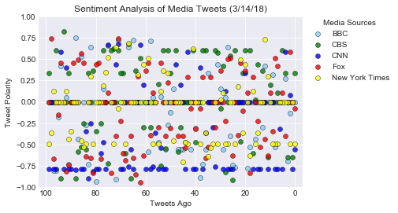
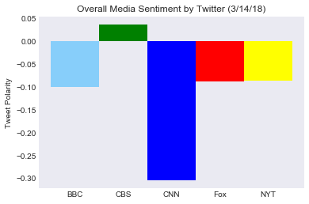

# News Mood: Twitter Analysis
In this project, I was tasked with creating a Python script (with the help of Python's libraries and wrappers) that would perform a sentiment analysis of BBC, CBS, CNN, Fox, and New York Times's Twitter activities.  With Tweepy and Sentiment Analyzer, I was able to gather the last one hundred tweets sent out by each news organization.  The sentiments are ranged from -1 to 1 (-1 representing negative sentiements, 0 representing neutral sentiments, and 1 representing positive sentiments.  After collecting the data, I created a bar chart and scatterplot with Seaborn and Matplotlib to reflect the sentiment analysis of the five news outlets.

# News Mood


```python
# Dependencies
import tweepy
import numpy as np
import pandas as pd
import matplotlib.pyplot as plt
import seaborn as sns
from pprint import pprint

# Import and Initialize Sentiment Analyzer
from vaderSentiment.vaderSentiment import SentimentIntensityAnalyzer
analyzer = SentimentIntensityAnalyzer()

# Twitter API Keys
from twt_config import (consumer_key, 
                    consumer_secret, 
                    access_token, 
                    access_token_secret)

# Setup Tweepy API Authentication
auth = tweepy.OAuthHandler(consumer_key, consumer_secret)
auth.set_access_token(access_token, access_token_secret)
api = tweepy.API(auth, parser=tweepy.parsers.JSONParser())
```


```python
# Create
target_users = ["@BBCNews", "@CBSNews", "@CNN", "@FoxNews", "@nytimes"]
sentiments_list = []

for user in target_users: 
    comp_list = []
    pos_list = []
    neg_list = []
    neu_list = []
    
    public_tweets = api.search(user, count=100, result_type="recent")

    for tweet in public_tweets["statuses"]:
        date = tweet["created_at"]
        results = analyzer.polarity_scores(tweet["text"])
        comp = results["compound"]
        pos = results["pos"]
        neg = results["neg"]
        neu = results["neu"]

        comp_list.append(comp)
        pos_list.append(pos)
        neg_list.append(neg)
        neu_list.append(neu)

    sentiments = {"User": user, "Date": date, "Compound": comp_list, "Positive": pos_list, 
                  "Negative": neg_list, "Neutral": neu_list}
    #pprint(sentiments)
    sentiments_df = pd.DataFrame.from_dict(sentiments)
    sentiments_list.append(sentiments_df)
    
```


```python
final_sentiments_df = pd.concat(sentiments_list)
final_sentiments_df = final_sentiments_df[["User", "Date", "Compound", "Positive", "Neutral", "Negative"]]
final_sentiments_df.head()
```


<div>
<style>
    .dataframe thead tr:only-child th {
        text-align: right;
    }

    .dataframe thead th {
        text-align: left;
    }

    .dataframe tbody tr th {
        vertical-align: top;
    }
</style>
<table border="1" class="dataframe">
  <thead>
    <tr style="text-align: right;">
      <th></th>
      <th>User</th>
      <th>Date</th>
      <th>Compound</th>
      <th>Positive</th>
      <th>Neutral</th>
      <th>Negative</th>
    </tr>
  </thead>
  <tbody>
    <tr>
      <th>0</th>
      <td>@BBCNews</td>
      <td>Wed Mar 14 01:03:30 +0000 2018</td>
      <td>0.0000</td>
      <td>0.000</td>
      <td>1.000</td>
      <td>0.000</td>
    </tr>
    <tr>
      <th>1</th>
      <td>@BBCNews</td>
      <td>Wed Mar 14 01:03:30 +0000 2018</td>
      <td>0.0000</td>
      <td>0.000</td>
      <td>1.000</td>
      <td>0.000</td>
    </tr>
    <tr>
      <th>2</th>
      <td>@BBCNews</td>
      <td>Wed Mar 14 01:03:30 +0000 2018</td>
      <td>-0.1326</td>
      <td>0.102</td>
      <td>0.765</td>
      <td>0.133</td>
    </tr>
    <tr>
      <th>3</th>
      <td>@BBCNews</td>
      <td>Wed Mar 14 01:03:30 +0000 2018</td>
      <td>-0.6908</td>
      <td>0.000</td>
      <td>0.824</td>
      <td>0.176</td>
    </tr>
    <tr>
      <th>4</th>
      <td>@BBCNews</td>
      <td>Wed Mar 14 01:03:30 +0000 2018</td>
      <td>0.2732</td>
      <td>0.110</td>
      <td>0.890</td>
      <td>0.000</td>
    </tr>
  </tbody>
</table>
</div>


```python
bbc_sentiments = sentiments_list[0]
cbs_sentiments = sentiments_list[1]
cnn_sentiments = sentiments_list[2]
fox_sentiments = sentiments_list[3]
nyt_sentiments = sentiments_list[4]

sns.set_style("darkgrid")
plt.title("Sentiment Analysis of Media Tweets (3/14/18)")
plt.ylabel("Tweet Polarity")
plt.xlabel("Tweets Ago")
plt.ylim(-1, 1)
plt.xlim(103, -3)

# Plot media sentiments
plt.scatter(np.arange(len(bbc_sentiments["Date"])), 
            bbc_sentiments["Compound"], color="lightskyblue", linewidth=0.5, alpha=0.8, edgecolor="black", label="BBC")
plt.scatter(np.arange(len(cbs_sentiments["Date"])), 
            cbs_sentiments["Compound"], color="green", linewidth=0.5, alpha=0.8, edgecolor="black", label="CBS")
plt.scatter(np.arange(len(cnn_sentiments["Date"])), 
            cnn_sentiments["Compound"], color="blue", linewidth=0.5, alpha=0.8, edgecolor="black", label="CNN")
plt.scatter(np.arange(len(fox_sentiments["Date"])), 
            fox_sentiments["Compound"], color="red", linewidth=0.5, alpha=0.8, edgecolor="black", label="Fox")
plt.scatter(np.arange(len(nyt_sentiments["Date"])), 
            nyt_sentiments["Compound"], color="yellow", linewidth=0.5, alpha=0.8, edgecolor="black", label="New York Times")
plt.legend(loc='center left', bbox_to_anchor=(1, 0.8), title="Media Sources")
plt.show()
```





```python
# Find sum of compounds and put in a list
bbc_overall = bbc_sentiments["Compound"].mean()
cbs_overall = cbs_sentiments["Compound"].mean()
cnn_overall = cnn_sentiments["Compound"].mean()
fox_overall = fox_sentiments["Compound"].mean()
nyt_overall = nyt_sentiments["Compound"].mean()
overall_list = [bbc_sum, cbs_sum, cnn_sum, fox_sum, nyt_sum]

colors = ["lightskyblue", "green", "blue", "red", "yellow"]
sns.set_style("dark")
plt.title("Overall Media Sentiment by Twitter (3/14/18)")
plt.ylabel("Tweet Polarity")
plt.xticks(np.arange(5), ("BBC", "CBS", "CNN", "Fox", "NYT") )
# Create bar chart
x = np.arange(5)
plt.bar(x, overall_list, color=colors, width=1)
plt.show()
```





```python
final_sentiments_df.to_csv("news_media_twitter_sentiments.csv")
```
